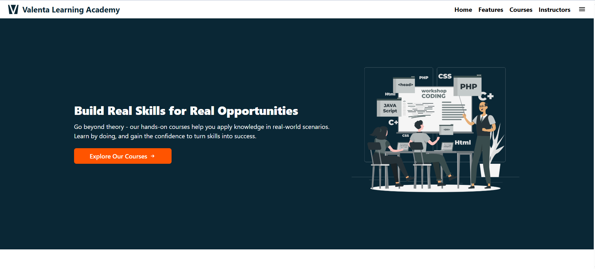

# Valenta Learning Academy

A full-stack course learning platform where students can explore, enroll, and learn various tech courses like DSA, Full Stack Development, AWS, and DevOps.

### 🔐 Home Page

## 🚀 Features

- Student Authentication (Signup/Login)
- Browse All Courses
- Enroll in Courses
- View Enrolled Courses
- Instructor Info
- Responsive UI

## 🛠️ Tech Stack

- **Frontend**: React, Tailwind CSS
- **Backend**: Node.js, Express
- **Database**: MongoDB
- **Authentication**: JWT, bcrypt
- **Deployment**  :
  - Frontend: Netlify  
  - Backend: Render  

---

## 🧑‍💻 Running Locally

### ✅ Prerequisites

- Node.js installed (v18+ recommended)
- MongoDB connection URI (MongoDB Atlas or local MongoDB)

Follow these steps to run the project on your local machine.

###  Clone the repository

git clone https://github.com/PurviMurkute/Munificent-Technology-take-home-assignment.git

## Backend Setup
cd server
npm install

### Create .env file in backend/ folder:

- MONGO_URL=your_mongodb_connection_string
- JWT_SECRET=your_jwt_secret

- **Start the backend server**: npm run dev

---

## Frontend Setup
cd frontend
npm install

### Create .env file in frontend/ folder:

- VITE_API_URL=http://localhost:5000

- **Start the backend server**: npm run dev

## 📬 Contact

### LinkedIn

### Email
Email: purvimurkute123@gmail.com
### Portfolio

### Peerlist

